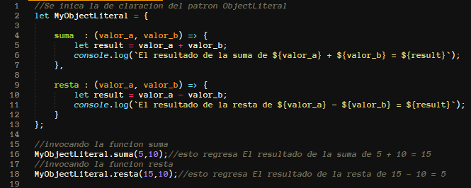
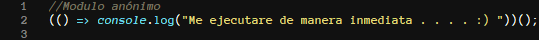
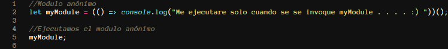
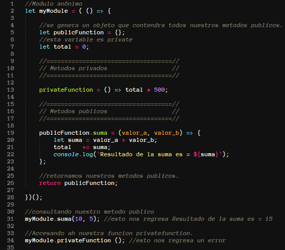
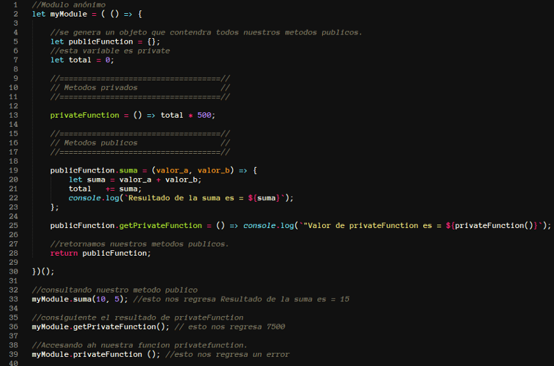
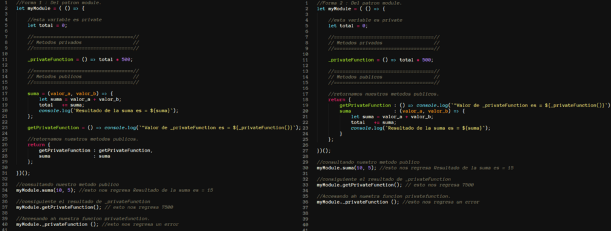
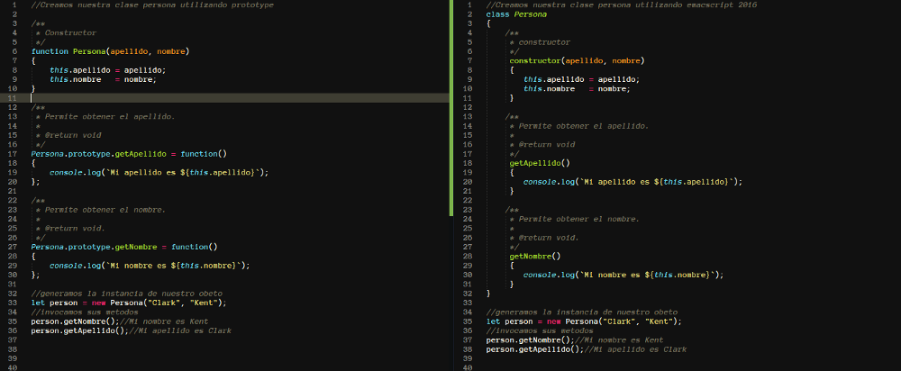
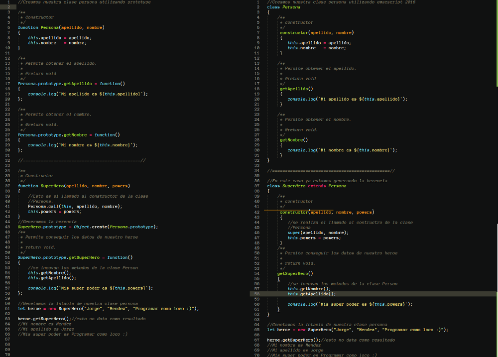
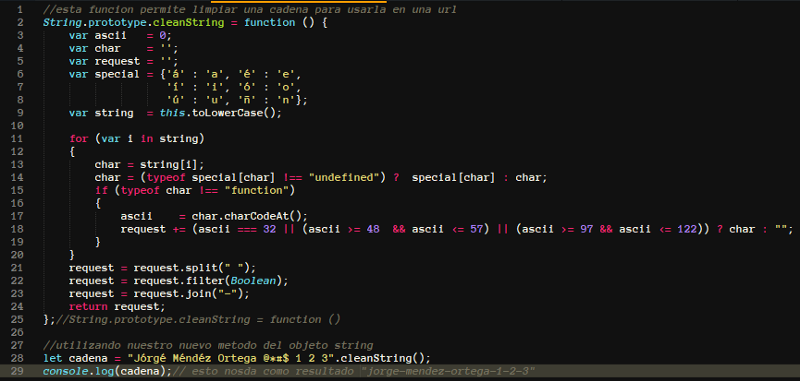

**Patrones de diseño en JavaScript**

En este post, se mostraran algunas de las implementaciones de
*JavaScript* explicando algunos de sus patrones de diseño (para todos
los ejemplo realizados se utilizara ***emac2016 o 262***).

En la actualidad es muy común que como desarrolladores nos preguntemos
cuál es una de las mejores formas de implementar un flujo de trabajo
utilizando *JavaScript*, realmente no existe una respuesta concreta a
esta única pregunta, ya que cada aplicación tiene sus propias
necesidades individuales por lo que es necesario pensar en dónde
consideramos que un patrón nos pueda ofrecer una solución ideal,
teniendo lo anterior en cuenta realicé la siguiente pregunta.

**¿Qué es un patrón de diseño?**

Es la base para la búsqueda de soluciones a problemas muy comunes en el
desarrollo de aplicativos y otros ámbitos referentes al diseño de
interacciones o interfaces. (fuente wikipedia)

Por lo que se podría resumir de una manera más sencilla como “Es una
manera de resolver una problemática”, un patrón de diseño tiene que
cumplir por lo menos con siguiente objetivos.

1 .- Estandarizar le lenguaje entre desarrolladores.  
2.- Evitar perder tiempo en soluciones a problemas ya resueltos o
conocidos.  
3 .- Crear código que se pueda reutilizar.

**Manos a la obra**

Después de un poco de teoría empecemos con lo divertido, hablemos de
código :). Existen varios patrones de diseño en este caso solo
hablaremos de 3 patrones.

**Patrón Object Literals**

Tal cual su nombre lo dice este patrón se conforma con la creación de un
objeto prácticamente un *JSON*, una de las bondades de este patrón es
que nos permite escribir el código de una manera organizada y no se
corrompe el **scope**(**alcance**) global con nombres innecesarios lo
cual es una muy buena práctica, sobre todo para los proyectos muy
grandes.

Como se comenta al principio la notación de este patrón es muy similar a
la construcción de un JSON ya que cuenta con identificadores que permite
el acceso al contenido de cada uno de ellos.

Muestra del
patrón ObjectLiteral Fig-0

Cabe mencionar que el patrón Object Literals es la base para el
siguiente patrón ya que lo utilizaremos para el manejo de la lógica.

**Patrón Module**

Para poder comprender este patrón es necesario entender el siguiente
concepto de esta función.

Declaración de
nuestro modulo anónimo Fig-1

Ese tipo de declaración se conoce como ***IIFE***
(***Immediately-Invoked-Function-Expressions***) como su nombre lo dice
es una función que se ejecuta de manera inmediata, este tipo de función
crea un nuevo scope y genera “*privacidad*”. JavaScript no maneja el
concepto de “*privacidad*”, pero generando un nuevo *scope* podemos
simularlo, esto se logra cuando envolvemos toda nuestra lógica de
nuestra aplicación dentro de un contenedor. La idea es solo retornar las
partes que nosotros necesitamos, dejando las otras partes de nuestro
código fuera del *scope* global.

Después de crear nuestro nuevo *scope*, necesitaremos un *namespace* de
nuestro código que pueda tener acceso a lo que nuestro modulo anónimo
retorne.

NameSpace : Variable con la que se genera la referencia ah nuestro
modulo anónimo.

Declarando
nuestro namespace Fig-2.

Hasta este momento podemos tener acceso a lo que retorne nuestro modulo
anónimo, con anterioridad se habló de manejo de privacidad dentro de
este patrón para poder mostrar este concepto funcionando generemos un
ejemplo.

Ejemplo del
patrón module Fig-3

Como se muestra en el ejemplo generamos un módulo, el cual nos permite
realizar una suma como podemos ver a simple vista tenemos nuestro código
común y corriente pero lo interesante es que ya tenemos una privacidad
ya que no podemos tener acceso al método *privateFunction*, pero si al
método *suma* y esto se debe a que solo estamos retornando todo lo que
contenga la variable *publicFunction* por lo que no esté dentro de esta
variable será privado y solo se tendrá acceso dentro del *scope* de
nuestro modulo :). 

La pregunta que te puedes estar realizando en este momento es ¿Cómo
consulto la respuesta de *privateFunction*? Para esto tendríamos que
generar una función publica que obtenga el resultado que lanza
*privateFunction*, por lo que nuestra solución quedaría de la siguiente
manera.

Ejemplo del
patrón module consultando la respuesta de privateFunction Fig-4

Como podemos ver este patrón nos permite manipular el concepto de
privacidad el cual resulta muy útil cuando no queremos que toda la
funcionalidad de nuestro aplicativo este expuesta, la manera de escribir
el código para el patrón module se puede realizar de maneras diferentes.

Maneras de
escribir el patrón module Fig-5

Nota : en este patrón es común ver que todos los métodos privados
cuentan con el prefijo **\_.** Tomando en cuenta la recomendación
anterior nuestro código de ejemplo se mostraría de la manera siguiente.

Aplicando la
convención \_ Fig-6

**Patrón Prototype**

Este patrón de diseño tiene como finalidad crear nuevos objetos
duplicándolos, clonando una instancia creada previamente, resumiéndolo
de una maneras más sencilla se podría decir que el uso de este patrón es
lo más cercano a *POO (Programación Orientada a Objetos)*, con los
nuevas funciones de *EmacScript 2016* esto puede usar armando *class,
extends etc..*

Otra de las características es que todos los objetos en JavaScript
cuentan con la propiedad *proto* lo cual facilita crear nuevas funciones
para clases ya existentes prácticamente este patrón es la onda jejeje.

Para poder comprender mejor este patrón vamos a crear unas clases usando
*prototype* y también lo crearemos utilizando las nuevas funciones de
*emacScritpt*.

**Paso 1 :** Creamos nuestras clases, el ejemplo de la izquierda es
usando *prototype*, el ejemplo de la derecha es usando *class* de
*EmacScripts.*

Ejemplo de
prototype Fig-7

**Paso 2** : Para el manejo de la herencia en *EmacScript 2016* ya se
puede utilizar *extends,* en versiones anteriores la herencia se
manejaba de una manera mas compleja. 

Ejemplo del
manejo de herencia Fig-10

Como se puede ver el manejo del patrón *portotype* es lo mas cercado a
*POO*, pero si recuerdan comentamos que todos los objetos de JavaScript
cuentan con la propiedad *proto* por lo que podríamos agregar nuevas
funcionalidades ah objetos ya establecidos, por ejemplo podríamos crear
una nueva función para el Objeto String.

Usando
prototype para agregar una nueva función al objeto string Fig-11

**Conclusión**

Los patrones de diseño son un camino para solucionar una problemática de
maneras distintas pero siempre obtendremos una solucion que se podrá
adaptar ah nuestro aplicativo. por ultimo se podría decir que para
construir nuestro aplicativo no existe un camino correcto pero si puede
existir un patron que nos facilite llegar ah ese camino.
